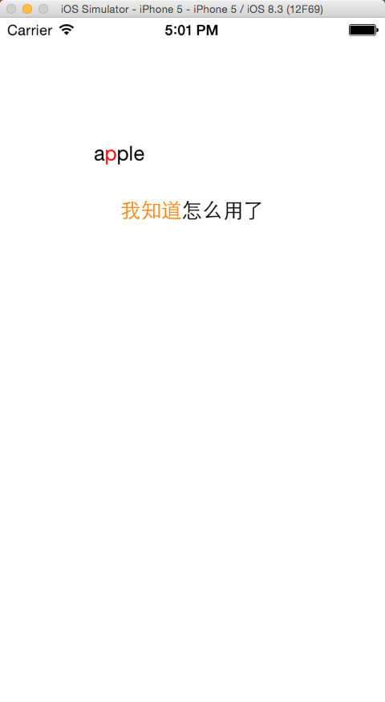

# 快速创建彩色文字的Label
* 如何使用?

  > 1. 手动将本分类的两个文件直接拖到工程目录即可使用.

* 使用方法:

  ```objective-c
      // 例子1
      UILabel *firstLabel = [UILabel text:@"我知道怎么用了" WithColor:[UIColor orangeColor] andRanged:NSMakeRange(0, 3)];
      firstLabel.frame = CGRectMake(100, 100, 200, 20);
      // 例子2
       customLabel = [UILabel new];
       customLabel.frame = CGRectMake(100, 150, 200, 20);
       customLabel.text = @"apple";
       [customLabel textWithColor:[UIColor redColor] andRanged:NSMakeRange(1, 1)];
      
    
  ``` 
  
* 执行效果:
* 
   
* 使用注意:

 > label的值为nil或者文本长度为0,将没有任何效果.  
 > 如果设置颜色范围超过文本长度,将只会只对文本长度范围内有效.   